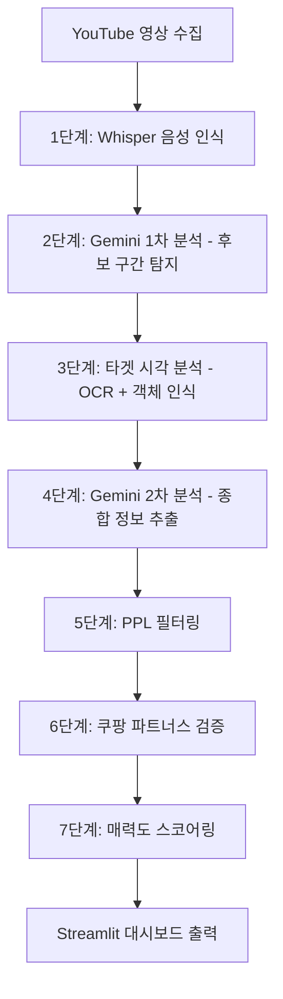

# Architecture Document: 연예인 추천 아이템 자동화 릴스 시스템

## 1. 시스템 개요

### 1.1. 핵심 목표
- 연예인 YouTube 영상에서 제품 추천 구간을 자동 탐지
- Instagram Reels용 콘텐츠 후보 생성
- 쿠팡 파트너스를 통한 제휴 마케팅 수익 창출

### 1.2. 주요 특징
- **AI 2-Pass 파이프라인**: 키워드 방식의 한계를 극복한 정교한 분석
- **GPU 비용 최적화**: 타겟 시간대만 시각 분석하여 비용 효율성 극대화
- **완전 자동화**: n8n을 통한 24/7 무인 운영
- **실시간 관리**: Streamlit 기반 대시보드로 즉시 검토 및 승인

## 2. 핵심 아키텍처: AI 2-Pass 파이프라인



### 2.1. 단계별 상세 분석

#### 1단계: 음성 인식 (Whisper)
- **엔진**: OpenAI Whisper `small` 모델 (오픈소스)
- **출력**: 타임스탬프가 포함된 정확한 스크립트
- **실행 환경**: GPU 서버

#### 2단계: 1차 AI 분석 (Gemini 2.5 Flash)
- **목적**: 제품 추천 후보 구간 탐지
- **입력**: 전체 영상 스크립트
- **출력**: 후보 시간대 목록 (start_time, end_time, confidence_score)
- **핵심 로직**: 맥락적 신호 포착 (지칭 패턴, 묘사 패턴, 경험 공유 등)

#### 3단계: 타겟 시각 분석
- **대상**: 후보 시간대의 프레임만 선별 분석
- **기술**: EasyOCR (텍스트 인식) + YOLOv8 (객체 인식)
- **실행 환경**: GPU 서버
- **비용 최적화**: 전체 영상이 아닌 타겟 구간만 처리

#### 4단계: 2차 AI 분석 (Gemini 2.5 Flash)
- **목적**: 최종 상세 정보 추출
- **입력**: 음성 + 시각 정보 결합
- **출력**: 구조화된 제품 정보 (JSON 스키마)

#### 5단계: PPL 필터링
- **목적**: 유료광고 콘텐츠 자동 분류
- **방법**: 영상 설명 + 음성 맥락 분석
- **결과**: PPL 확률 스코어 및 별도 목록 분류

#### 6단계: 수익화 검증
- **API**: 쿠팡 파트너스 자동 조회
- **처리**: 검색 불가 제품은 '수익화 필터링 목록'으로 분리

#### 7단계: 매력도 스코어링
- **공식**: `총점 = (0.50 * 감성 강도) + (0.35 * 실사용 인증 강도) + (0.15 * 인플루언서 신뢰도)`
- **범위**: 0-100점
- **활용**: 우선순위 정렬 및 콘텐츠 선별

## 3. 시스템 구성 요소

### 3.1. 데이터 수집 레이어
- **채널 관리**: Google Sheets 기반 채널 목록 관리
- **영상 수집**: RSS 피드 + Playwright 웹 스크래핑
- **필터링**: 연예인 이름 기반 미디어 채널 필터링

### 3.2. AI 분석 레이어
- **음성 처리**: Whisper 모델 (GPU 서버)
- **텍스트 분석**: Gemini 2.5 Flash API
- **시각 분석**: EasyOCR + YOLOv8 (GPU 서버)
- **데이터 통합**: JSON 스키마 기반 구조화

### 3.3. 비즈니스 로직 레이어
- **PPL 탐지**: AI 기반 유료광고 확률 분석
- **수익화 검증**: 쿠팡 파트너스 API 연동
- **스코어링**: 다차원 매력도 평가 엔진
- **상태 관리**: 워크플로우 기반 후보 상태 추적

### 3.4. 사용자 인터페이스 레이어
- **관리 대시보드**: Streamlit 기반 웹 애플리케이션
- **검토 도구**: 타임스탬프 자동 재생, 이미지 검색 지원
- **상태 관리**: 승인/반려/수정 워크플로우
- **콘텐츠 생성**: AI 생성 제목/해시태그 표시

### 3.5. 자동화 오케스트레이션 레이어
- **워크플로우 엔진**: n8n (자체 호스팅)
- **스케줄링**: Cron 기반 자동 실행
- **모니터링**: Slack 알림 연동
- **에러 처리**: 실패 시 재시도 로직

## 4. 데이터 구조

### 4.1. 핵심 JSON 스키마
```json
{
  "source_info": {
    "celebrity_name": "string",
    "channel_name": "string", 
    "video_title": "string",
    "video_url": "string",
    "upload_date": "date"
  },
  "candidate_info": {
    "product_name_ai": "string",
    "clip_start_time": "number",
    "clip_end_time": "number",
    "category_path": ["array"],
    "features": ["array"],
    "score_details": {
      "total": "number",
      "sentiment_score": "number",
      "endorsement_score": "number", 
      "influencer_score": "number"
    },
    "hook_sentence": "string",
    "summary_for_caption": "string",
    "recommended_titles": ["array"],
    "recommended_hashtags": ["array"]
  },
  "monetization_info": {
    "is_coupang_product": "boolean",
    "coupang_url_ai": "string"
  },
  "status_info": {
    "current_status": "enum",
    "is_ppl": "boolean",
    "ppl_confidence": "number"
  }
}
```

### 4.2. 상태 관리
- `needs_review`: 검토 대기
- `approved`: 승인됨
- `rejected`: 반려됨
- `filtered_no_coupang`: 수익화 불가
- `published`: 업로드 완료

## 5. 기술 스택

### 5.1. 개발 환경
- **언어**: Python 3.11
- **데이터베이스**: SQLite (개발/초기 운영)
- **프레임워크**: Streamlit (대시보드)

### 5.2. AI/ML 스택
- **음성 인식**: OpenAI Whisper (오픈소스)
- **텍스트 분석**: Google Gemini 2.5 Flash
- **시각 분석**: EasyOCR, YOLOv8
- **웹 스크래핑**: Playwright

### 5.3. 인프라 스택
- **오케스트레이션**: n8n (자체 호스팅)
- **데이터 관리**: Google Sheets API
- **API 연동**: Coupang Partners API
- **알림**: Slack API

## 6. 배포 전략

### 6.1. 1단계: 로컬 개발 (MacBook)
- 핵심 로직 개발 및 프로토타입 검증
- Streamlit 대시보드 개발
- 소규모 테스트 데이터로 정확도 검증

### 6.2. 2단계: 클라우드 배포
- GPU 서버: 음성/시각 분석 처리
- CPU 서버: 기본 로직 및 API 처리
- n8n 오케스트레이션 설정
- 24/7 자동화 운영 시작

## 7. 성능 및 비용 최적화

### 7.1. 성능 최적화
- **타겟 분석**: 전체 영상 대신 후보 구간만 시각 분석
- **캐싱**: 분석 결과 캐싱으로 중복 처리 방지
- **병렬 처리**: 다중 영상 동시 분석

### 7.2. 비용 최적화
- **Whisper 오픈소스**: API 비용 0원
- **Gemini Flash**: 저비용 고성능 모델 선택
- **GPU 서버**: 필요 시에만 활용하는 온디맨드 방식

### 7.3. 예상 운영 비용 (월 900편 기준)
- Gemini API: ~700원
- GPU 서버: ~5,900원  
- CPU 서버: ~8,300원
- **총 비용**: ~15,000원/월

## 8. 확장성 고려사항

### 8.1. 단기 확장성
- 채널 수 증가: 병렬 처리로 대응
- 영상 수 증가: 스케일링 가능한 클라우드 인프라
- 정확도 향상: 피드백 기반 학습 데이터 축적

### 8.2. 장기 확장성
- 다중 플랫폼 지원 (TikTok, YouTube Shorts)
- 다양한 제휴 마케팅 채널 확장
- 자동 영상 편집 기능 추가
- 실시간 트렌드 분석 기능

## 9. 리스크 및 대응 방안

### 9.1. 기술적 리스크
- **AI 정확도**: 피드백 루프를 통한 지속적 개선
- **API 제한**: 다중 API 백업 및 레이트 리미팅
- **스크래핑 차단**: 다양한 수집 방법론 확보

### 9.2. 비즈니스 리스크
- **저작권**: 페어유즈 가이드라인 준수
- **플랫폼 정책**: 정기적인 정책 모니터링
- **제휴 마케팅 규정**: 관련 법규 준수 체계 구축

## 10. 성공 지표

### 10.1. 기술적 지표
- **정확도**: AI 분석 정확도 >85%
- **처리 속도**: 영상당 평균 분석 시간 <5분
- **비용 효율성**: 영상당 분석 비용 <20원

### 10.2. 비즈니스 지표
- **콘텐츠 생산량**: 일 평균 승인 후보 >5개
- **수익화 전환율**: 승인 후보 중 실제 수익 발생 >30%
- **ROI**: 시스템 운영비 대비 수익률 >300%