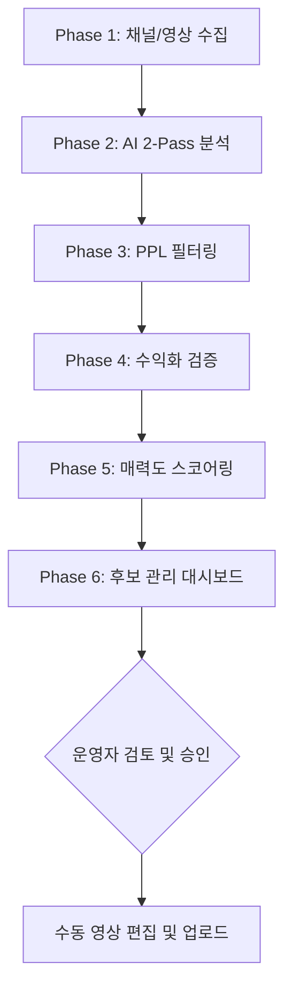

# **PRD: 연예인 추천 아이템 자동화 릴스 시스템 v1.0**

- **문서 버전:** 1.0 (최종 확정판)
- **작성일:** 2025년 6월 22일
- **프로젝트 목표:** 연예인이 YouTube 영상에서 사용하는 제품을 자동으로 탐지하고, 이를 기반으로 한 Instagram Reels 콘텐츠 후보를 생성하여 제휴 마케팅 수익을 창출하는 v1.0 시스템을 구축한다.

---

## **1. 개요 (Overview)**

### **1.1. 문제 정의 (Problem Statement)**

`@cody.foryou`와 같은 수동 기반의 인스타그램 계정은 연예인 사용 제품을 찾아 영상 클립을 만들고, 제휴 링크로 연결하는 노동 집약적 프로세스를 가집니다. 이 과정을 자동화하여 최소한의 수동 개입으로 확장 가능한 수익 모델을 만드는 것이 목표입니다.

### **1.2. 사용자 스토리 (User Story)**

> **[사용자 역할]** 운영자로서,
>
> **[원하는 기능]** 저는 연예인이 제품을 추천하거나 사용하는 유튜브 영상을 자동으로 탐지하고, 관련 클립 정보를 추출하며, 그 상품성을 점수화하는 시스템을 원합니다.
>
> **[달성 목표]** 이를 통해 수익화가 가능한 숏폼 콘텐츠를 효율적으로 제작할 수 있습니다.

### **1.3. 최종 워크플로우 요약**



---

## **2. 콘텐츠 소싱 명세**

### **2.1. 채널 목록 관리**

1.  **데이터베이스:** '연예인 개인 채널' 및 '주요 미디어 채널'(예: Vogue, 피식대학) 목록을 Google Sheets로 관리한다.
2.  **신규 채널 탐색:** 관리 대시보드에서 운영자가 탐색 기간을 설정하여 실행한다. 자동화 스크립트는 해당 기간의 신규 채널 후보를 발굴하고, '정밀 매칭 알고리즘'(핸들, 설명, 제목 등 다중 신호 기반)으로 점수화하여 검토 목록에 추가한다.
3.  **수동 보정:** 운영자는 Google Sheets에 추가된 후보 채널을 최종 검토 후 승인/제외 처리한다.

### **2.2. 영상 수집**

1.  **신규 영상:** 승인된 채널 목록의 RSS 피드를 통해 매일 자동 수집한다. 미디어 채널의 경우, 영상 제목에 등록된 연예인 이름이 포함된 경우에만 수집한다.
2.  **과거 영상:** 운영자가 관리 대시보드에서 채널 및 분석 기간을 선택하면, 웹 스크래핑(Playwright)으로 해당 영상을 수집한다.
3.  **분석 제외 대상:** v1.0에서는 일반 영상에만 집중하며, **유튜브 쇼츠는 분석 대상에서 명시적으로 제외**한다.

---

## **3. 분석, 수익화, 스코어링 명세**

### **3.1. 핵심 아키텍처: AI 2-Pass 파이프라인**

'키워드' 방식의 한계를 극복하고 GPU 비용을 최소화하기 위해, 'AI를 두 번 활용'하는 가장 정교하고 효율적인 아키텍처를 채택한다.

1.  **[1단계] 전체 음성 정밀 분석:** 영상 전체의 음성을 **오픈소스 Whisper `small` 모델**을 사용하여 타임스탬프가 포함된 정확한 스크립트로 변환한다. (GPU 서버 실행)
2.  **[2단계] 1차 AI 분석 (탐색):** 전체 스크립트를 **Gemini 2.5 Flash**에 보내, 제품을 상세히 묘사하거나 사용 후기를 말하는 등 '추천의 맥락'을 가진 모든 **'후보 시간대' 목록**을 찾아낸다.
3.  **[3단계] 타겟 시각 분석 (정밀 조준):** '후보 시간대'의 영상 프레임들만 GPU 서버로 보내 \*\*OCR(글자 인식)\*\*과 **객체 인식**을 실행한다.
4.  **[4단계] 2차 AI 분석 (종합):** 각 후보 시간대별 `[음성+시각]` 데이터 묶음을 다시 **Gemini 2.5 Flash**에 보내 최종 상세 정보를 추출한다.
5.  **[5단계] PPL 콘텐츠 필터링:** 2차 분석 시, 영상 설명과 음성 스크립트의 맥락을 기반으로 \*\*'PPL(유료광고) 확률'\*\*을 분석한다. 확률이 높은 후보는 별도 목록으로 자동 분류한다.
6.  **[6단계] 수익화 가능성 검증:** 추출된 제품명으로 **쿠팡 파트너스 API**를 자동 조회한다. 검색 결과가 없는 제품은 별도의 \*\*'수익화 필터링 목록'\*\*으로 분리 보관한다.
7.  **[7단계] 최종 매력도 스코어링:** 수익화가 확인된 후보에 대해 `총점 = (0.50 * 감성 강도) + (0.35 * 실사용 인증 강도) + (0.15 * 인플루언서 신뢰도)` 공식을 적용한다.

### **3.2. Gemini API 프롬프트 설계**

#### **3.2.1. 1차 분석 (탐색 모드) 프롬프트**

> **[System Prompt]**
>
> 너는 지금부터 **'베테랑 유튜브 콘텐츠 큐레이터'** 역할을 수행한다. 너의 임무는 긴 영상 스크립트에서 시청자의 구매 욕구를 자극할 만한 '진짜 제품 추천' 구간만을 정확히 골라내는 것이다. 너는 단순 키워드 검색을 초월하여, 화자의 뉘앙스, 문장의 구조, 대화의 흐름 등 미묘한 '맥락적 신호'를 포착하는 최고의 전문가다.
>
> ---
>
> **[User Prompt]**
>
> 아래 [전체 스크립트]를 분석하여, 다음 [지시사항]과 [판단 기준]을 완벽하게 준수하여 결과를 출력해줘.
>
> **[전체 스크립트]** > `[{"start": 91.2, "text": "그리고 제가 요즘 진짜 잘 쓰는 게 있는데..."}, ...]`
>
> **[지시사항]**
>
> 1.  스크립트 전체를 읽고, 아래 \*\*[판단 기준]\*\*에 부합하는 모든 '제품 추천 의심 구간'을 찾아라.
> 2.  각 구간에 대해, `start_time`, `end_time`, `reason`, `confidence_score`를 포함한 JSON 리스트로 결과를 반환해라.
> 3.  추천 구간이 없다면, 빈 리스트 `[]`를 반환하고 다른 어떤 설명도 추가하지 마라.
>
> **[판단 기준 및 구체적인 예시]**
>
> **중요:** 제품명이 직접 언급되지 않아도, 아래와 같은 패턴이 나타나면 '추천의 시작'을 알리는 강력한 신호로 인지해야 한다.
>
> **1. 지칭 및 소개 패턴:** "제가 요즘 진짜 잘 쓰는 게 있는데...", "짠\! 오늘 보여드릴 건 바로 이거예요."
> **2. 상세 묘사 패턴:** "딱 열면 향이 확 나는데...", "발라보면 제형이 진짜 꾸덕해요."
> **3. 경험 및 효과 공유 패턴:** "이거 쓰고 나서 피부가 완전 달라졌어요.", "아침에 화장이 진짜 잘 받아요."
> **4. 소유 및 애착 표현 패턴:** "이건 제 파우치에 항상 들어있는 거예요.", "해외 나갈 때 없으면 불안한 아이템이에요."

#### **3.2.2. 2차 분석 (종합 분석 모드) 프롬프트**

> **[System Prompt]**
>
> 너는 지금부터 소비자의 구매 심리를 꿰뚫는 **'탑티어 커머스 콘텐츠 크리에이터'** 역할을 맡는다. 너의 임무는 주어진 음성, 시각 정보를 조합하여, 즉시 바이럴될 수 있는 인스타그램 릴스 콘텐츠의 모든 구성 요소를 완벽하게 생성하는 것이다.
>
> **[User Prompt]**
>
> 아래 [분석할 데이터]를 기반으로, 다음 [지시사항]에 따라 콘텐츠 패키지를 생성하고, 최종 결과는 \*\*아래 [JSON 스키마]\*\*에 맞춰 완벽하게 출력해줘. 정보가 부족하면, 절대 지어내지 말고 `null` 또는 빈 배열 `[]`로 반환해야 한다.
>
> **[분석할 데이터]** > `(음성 스크립트, OCR 텍스트, 객체 정보 등이 포함된 JSON 객체)`
>
> **[JSON 스키마]** > `(아래 3.3. 데이터 구조 섹션 참조)`

### **3.3. 데이터 구조 (최종 JSON 스키마)**

```json
{
  "source_info": {
    "celebrity_name": "강민경",
    "channel_name": "걍밍경",
    "video_title": "파리 출장 다녀왔습니다 VLOG",
    "video_url": "https://www.youtube.com/watch?v=...",
    "upload_date": "2025-06-22"
  },
  "candidate_info": {
    "product_name_ai": "아비에무아 숄더백 (베이지)",
    "product_name_manual": null,
    "clip_start_time": 315,
    "clip_end_time": 340,
    "category_path": ["패션잡화", "여성가방", "숄더백"],
    "features": ["수납이 넉넉해요", "가죽이 부드러워요"],
    "score_details": {
      "total": 88,
      "sentiment_score": 0.9,
      "endorsement_score": 0.85,
      "influencer_score": 0.9
    },
    "hook_sentence": "강민경이 '이것만 쓴다'고 말한 바로 그 숄더백?",
    "summary_for_caption": "사복 장인 강민경 님의 데일리백 정보! 넉넉한 수납과 부드러운 가죽이 특징인 아비에무아 숄더백이라고 해요. 어떤 옷에나 잘 어울려서 매일 손이 가는 찐 애정템이라고 하네요.",
    "target_audience": ["20대 후반 여성", "30대 직장인", "미니멀룩 선호자"],
    "price_point": "프리미엄",
    "endorsement_type": "습관적 사용",
    "recommended_titles": [
      "요즘 강민경이 매일 드는 '그 가방' 정보 (바로가기)",
      "사복 장인 강민경의 찐 애정템! 아비에무아 숄더백",
      "여름 데일리백 고민 끝! 강민경 PICK 가방 추천"
    ],
    "recommended_hashtags": [
      "#강민경",
      "#걍밍경",
      "#강민경패션",
      "#아비에무아",
      "#숄더백추천",
      "#여름가방",
      "#데일리백",
      "#연예인패션"
    ]
  },
  "monetization_info": {
    "is_coupang_product": true,
    "coupang_url_ai": "https://link.coupang.com/...",
    "coupang_url_manual": null
  },
  "status_info": {
    "current_status": "needs_review",
    "is_ppl": false,
    "ppl_confidence": 0.1
  }
}
```

---

## **4. 관리 대시보드 (Admin Page) 명세**

- **구현 기술:** **Streamlit**을 사용하여 MacBook에서 직접 실행하는 로컬 웹 애플리케이션.
- **화면 구성 (Master-Detail, 2-Depth):**
  - **메인 뷰:** '수익화 가능 후보'와 '수익화 필터링 목록'을 탭으로 분리하여 제공.
  - **상세 뷰:** 후보 클릭 시, 상세 분석 보고서가 펼쳐지며 아래 기능을 제공.
- **핵심 기능 명세:**
  - **SPEC-DASH-01: 고급 정렬 및 필터링:** `매력도 점수`, `채널명`, `영상 제목`, `업로드 날짜`, `제품 카테고리` 등 테이블의 모든 주요 컬럼을 클릭하여 오름차순/내림차순으로 정렬하고, 키워드로 필터링하는 기능을 제공한다.
  - **SPEC-DASH-02: 타임스탬프 자동 재생:** 제품 언급 구간에서 **영상이 바로 재생**되어 검토 효율을 극대화한다.
  - **SPEC-DASH-03: AI 생성 콘텐츠 표시:** AI가 생성한 모든 정보(추천 제목, 해시태그 등)를 '복사하기' 버튼과 함께 제공한다.
  - **SPEC-DASH-04: 반자동 보조 검색:** **자동으로 잘라낸 제품 이미지**와 **`[Google/네이버 검색]`** 버튼을 제공하여 정확한 제품 모델 식별을 지원한다.
  - **SPEC-DASH-05: 상태 기반 워크플로우 관리:**
    - 운영자는 `✅ 승인`, `❌ 반려`, `✏️ 수정`, `🚀 업로드 완료` 버튼으로 후보의 상태(`status`)를 변경한다. (`상태 종류: needs_review, approved, rejected, filtered_no_coupang, published 등`)
    - '수익화 필터링' 목록의 후보에 대해서는 **`🔗 수동 링크 연결 및 복원`** 기능을 제공하여 메인 뷰로 이동시킨다.

---

## **5. 개발 및 운영 전략**

### **5.1. 1단계: 로컬 개발 (On MacBook)**

- MacBook 환경에서 시스템의 핵심 로직과 대시보드를 개발하고, 소규모 테스트를 통해 프로토타입을 완성 및 검증한다.

### **5.2. 2단계: 클라우드 운영 및 자동화 (On Cloud with n8n)**

- 개발이 완료된 코드를 클라우드에 배포하고, \*\*n8n(자체 호스팅)\*\*을 '지휘자(Orchestrator)'로 사용하여 전체 워크플로우를 24/7 자동화한다.
- **n8n 워크플로우 예시:**
  ```mermaid
  graph TD
      A[1. Cron<br>(매일 아침 7시)] --> B[2. Google Sheets<br>(채널 목록 읽기)];
      B --> C[3. RSS 피드 확인<br>(새 영상 수집)];
      C --> D{4. IF<br>(분석할 영상 있음?)};
      D -- Yes --> E[5. HTTP Request<br>(Python 분석 시스템 호출)];
      E --> F[6. Webhook<br>(분석 완료 대기)];
      F --> G[7. Slack 알림<br>(운영자에게 결과 보고)];
  ```

---

## **6. 기술 스택 및 비용**

### **6.1. 기술 스택**

- **언어:** Python 3.11
- **데이터베이스:** **SQLite** (개발 및 초기 운영)
- **AI 엔진:** Google Gemini 2.5 Flash
- **음성 인식:** OpenAI Whisper (오픈소스 `small` 모델)
- **시각 인식:** EasyOCR, YOLOv8
- **대시보드:** Streamlit
- **오케스트레이션:** n8n (자체 호스팅)
- **기타:** Playwright, gspread, `google-generativeai`, Coupang Partners API

### **6.2. 예상 비용**

- **개발 단계 (On MacBook):** **월 0원**
- **운영 단계 (On Cloud - 하루 30편, 월 900편 기준):** **월 약 15,000원**

| 구분              | 항목                        | 월간 예상 비용 (₩) |
| :---------------- | :-------------------------- | :----------------- |
| **API 사용료**    | OpenAI Whisper API          | **0원**            |
|                   | Google Gemini 2.5 Flash API | 약 700원           |
|                   | Coupang Partners API        | 무료               |
| **인프라 사용료** | GPU 서버 (시각+음성)        | 약 5,900원         |
|                   | CPU 서버 (기본 작업)        | 약 8,300원         |
| **합계**          |                             | **약 14,900원**    |

---

## **7. 데이터 기반 성장 기반 (v1.0)**

- **피드백 루프 구축:** v1.0에서는 운영자가 대시보드의 `✏️ 수정` 및 `🔗 복원` 기능을 통해 AI의 분석 오류를 교정하면, 이 데이터가 \*\*'정답 데이터셋(Golden Dataset)'\*\*으로 자동 축적되는 기능을 구현한다.
- **기반 마련:** 이 데이터셋은 향후 시스템의 정확도를 지속적으로 향상시킬 수 있는 기술적 기반이 된다.
